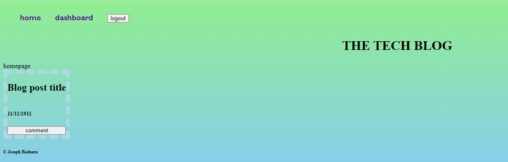

# Tech Blog MVC

## Table of Contents
- [Description](#description)
- [Installation](#installation)
- [Usage](#usage)

## Description
- This website allows you to log in, post and see blogs, and comments on other people's blogs!

## Installation
- N/A
- [Link to Application](https://jr-text-editor-077c473a9864.herokuapp.com/)

## Usage
- Sign up and log in with an email, username, and password.
- Go to the dashboard and click the "New Post +" button to creat a new blog.
- Press submit to upload the post. 
- See your blog posts on your dashboard and see others' posts on the homepage.
- Select the "comment" button on a post to leave a comment. 
